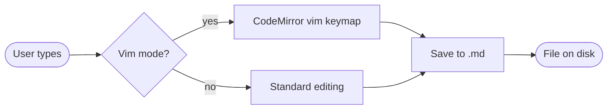
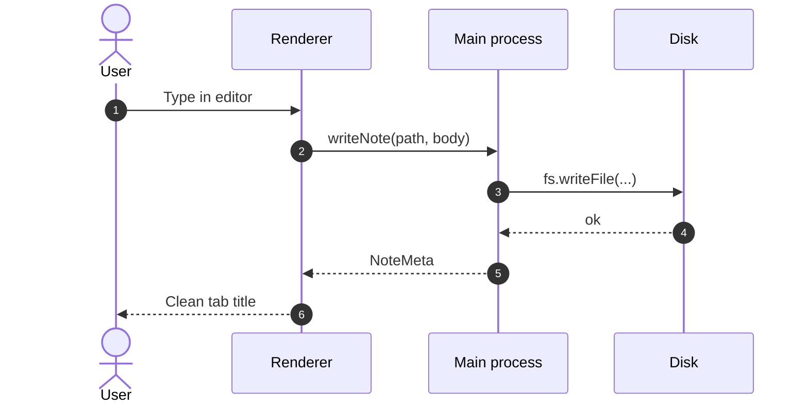
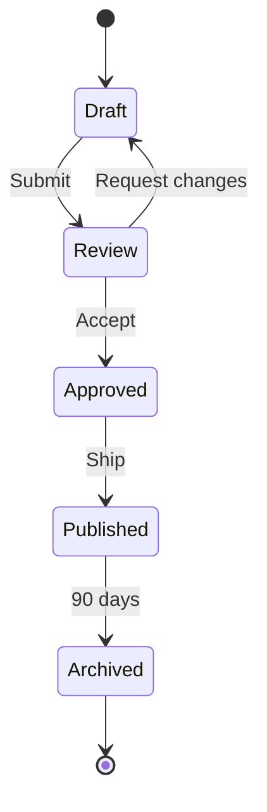
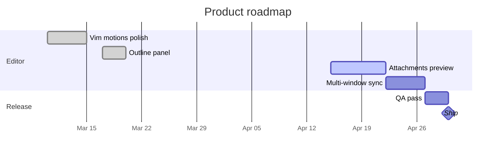
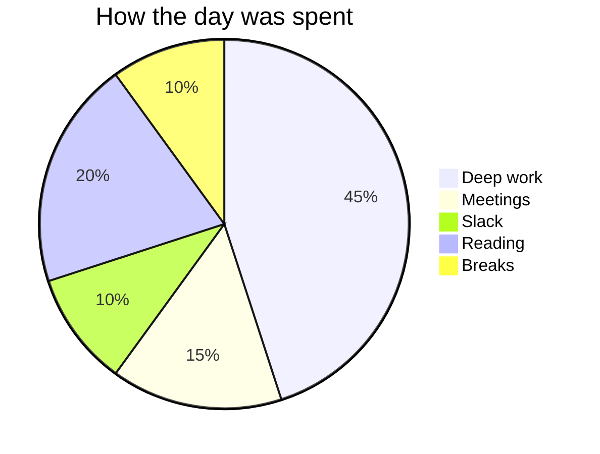
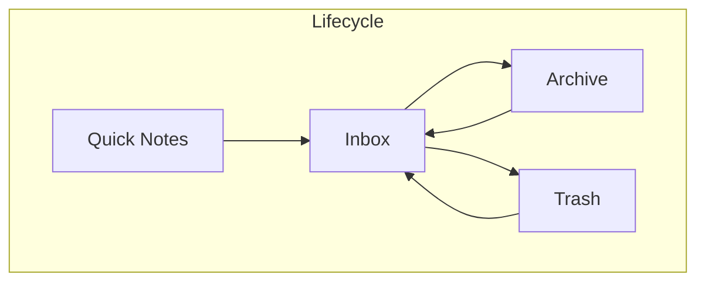

# Mermaid diagrams

Mermaid fences render inline in ZenNotes. They are still just markdown code blocks on disk, so you can version them, diff them, and edit them anywhere.

For TikZ, JSXGraph, and function-plot, see [[05b — Math Diagrams]].

## A fast way to insert one

Type `/` and choose **Code block**, then change the language to `mermaid`.

## Flowchart

## Sequence diagram

## State diagram

## Gantt chart

## Pie chart

## Vault map

## Working with diagrams in the app

- **Split** mode is usually the sweet spot: raw source on one side, rendered diagram on the other.
- Diagrams are still searchable because the source fence lives in the note body.
- If Mermaid syntax breaks, ZenNotes falls back to showing the source block, which makes failures debuggable instead of mysterious.

## What's next

Stay in diagram mode with [[05b — Math Diagrams]] if you want interactive geometry, coordinate figures, or compact function plots.

#demo #mermaid #diagrams
