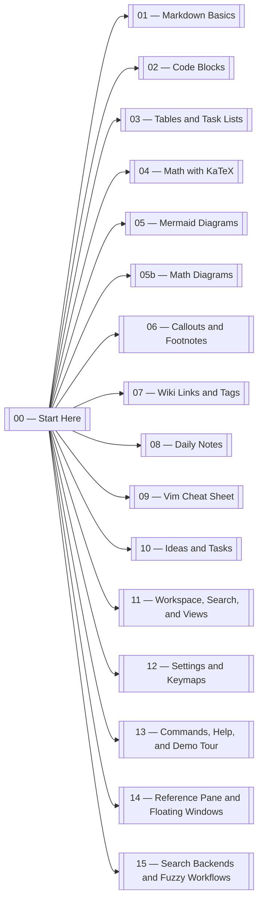

# Wiki links, tags, backlinks, and search

These features turn a folder of markdown files into a navigable vault.

## Wiki links

Point at other notes with `[[double brackets]]`. ZenNotes resolves them by note title, case-insensitively.

- Shortest form: [[01 — Markdown Basics]]
- Custom display text: [[11 — Workspace, Search, and Views|workspace guide]]
- Missing note: [[A Future Note]] — opening it offers to create the note

You can follow links with the mouse or keyboard:

- in Vim mode, put the cursor on a link and press `gd`
- markdown links and wikilinks both work
- PDFs can open directly into the reference pane

## Tags

Tags are plain inline text. They start with `#` and become searchable structure.

This demo folder uses tags like:

- #demo
- #reference
- #tasks
- #vim
- #search
- #workspace

The **Tags** view lets you browse notes matching one or more selected tags in a dedicated main-pane list.

## Connections

The **Connections** panel helps you inspect:

- outbound links from the current note
- backlinks into the current note
- unresolved link targets that still need a note

This is especially useful when you are writing specs, research notes, or project docs and want context without leaving the active note.

## Search modes

ZenNotes has two distinct searches:

### Note search

- `⌘P` opens the note search palette
- `Space f` opens the same search in Vim mode
- this search matches note titles and paths

### Vault text search

- `Space s t` opens vault text search
- it searches matching text lines across **Inbox**, **Quick Notes**, and **Archive**
- selecting a result opens the note and jumps to the matched line

Vault text search can run on different backends:

- **Auto** prefers `fzf`, then `ripgrep`, then built-in
- **Built-in** keeps everything inside ZenNotes
- **ripgrep** and **fzf** can be chosen explicitly
- custom binary paths can be configured in **Settings**
- the app shows the resolved runtime backend so you can see what is actually being used

## Graph of this tour

#demo #reference #search #links
