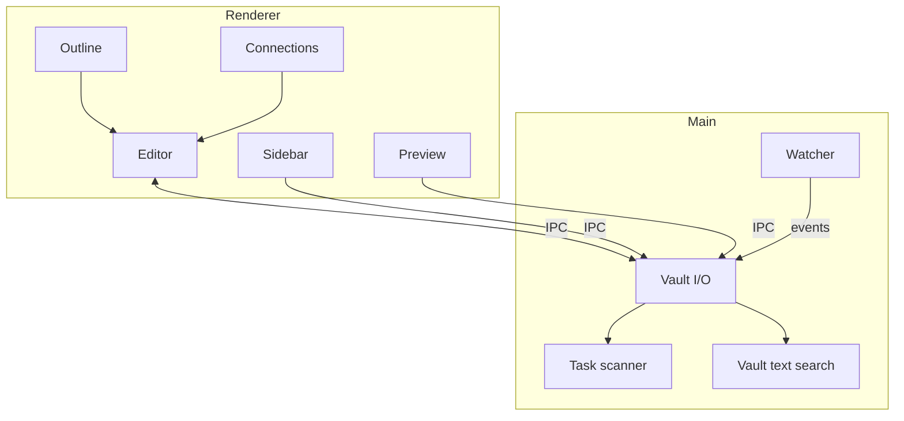

# Ideas and tasks — a realistic note

This is the kind of note most real users end up writing: prose, todos, links, snippets, diagrams, and operational context all mixed together. It shows how ZenNotes features compose instead of living in isolated demos.

> [!note]
> Status as of 2026-04-16. Use this note to test search, outline, connections, Tasks, and split view in one place.

## Open questions

- [ ] Should attachment previews appear inline for PDFs by default?
- [ ] Is the built-in text-search backend fast enough on large vaults when neither `fzf` nor `ripgrep` is available?
- [ ] Do we expose tag renaming from the UI, or keep it intentionally file-grep first?

## Working notes

- Quick capture starts in **Quick Notes**, but anything important should graduate into **Inbox**.
- Cold notes belong in **Archive**, which now opens as a dedicated main-pane list view.
- Deleted notes should go through **Trash**, where restore and permanent delete are separated on purpose.
- If tabs are hidden, `Space o` or `:buffers` becomes the fastest way to recover the current working set.

## Now

- [ ] Add a sample PDF + image to the tour so [[06 — Callouts and Footnotes]] can illustrate attachments and reference-pane workflows.
- [x] Document the Tasks tab behavior in [[03 — Tables and Task Lists]].
- [ ] Collect feedback on [[09 — Vim Cheat Sheet]] now that keymaps are configurable.
- [ ] Confirm the search backend badge is visible enough in the vault text search palette.

## Shipped

- [x] Vault text search can use **Auto**, **Built-in**, **ripgrep**, or **fzf**.
- [x] Custom binary paths can be configured when `rg` or `fzf` live outside `PATH`.
- [x] Settings now show the resolved runtime backend instead of only the requested one.
- [x] Archive and Trash both behave as list-style built-in tabs instead of sidebar dump zones.

## Cross-references

- Tour index: [[00 — Start Here]]
- Search and links: [[07 — Wiki Links and Tags]]
- Workspace guide: [[11 — Workspace, Search, and Views]]
- Settings and keymaps: [[12 — Settings and Keymaps]]

## A snippet I keep forgetting

Converting a buffer to hex in Node:

```ts
import { randomBytes } from 'node:crypto'

const buf = randomBytes(16)
console.log(buf.toString('hex'))
```

Converting back:

```ts
const hex = '01020304abcdef'
const buf = Buffer.from(hex, 'hex')
```

## Rough architecture sketch



## A little math

The rough cost model people keep re-deriving:

$$
T \approx 3 \cdot t \cdot \frac{m}{\text{bandwidth}}
$$

## Workflow checklist

- [ ] Try this note in **Edit**, **Split**, and **Preview**
- [ ] Open the **outline** and jump to "Workflow checklist"
- [ ] Open **Connections** and inspect backlinks
- [ ] Search for `backend` with `Space s t`
- [ ] Toggle **Zen mode**

#demo #tasks #planning #workspace
